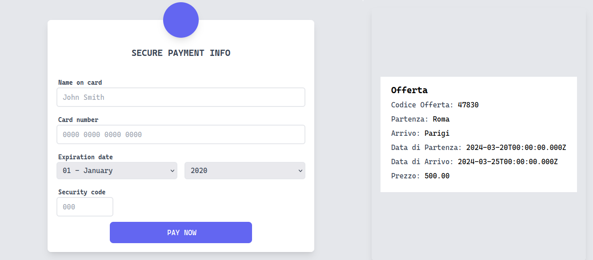

# ACMEsky Bank
ACMEsky bank è una single webpage application che viene utilizzata dall'utente per interfacciarsi ai servizi di banking.

## Tecnologie utilizzate
- javascript
- Tailwind

## Interfaccia grafica
### Home


## Esecuzione

Installa le dipendenze

```bash
pnpm install
```

Esegui
```bash
pnpm dev
```
