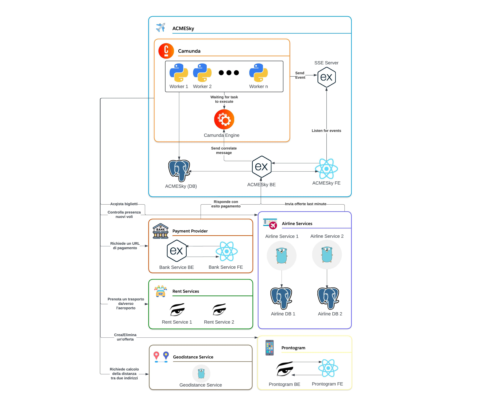

# Implementazione

In questa sezione vengono presentate le scelte implementative effettuate per la realizzazione dei servizi presenti in questo sistema.

## Diagramma architetturale

Il diagramma descrive come i diversi servizi comunicano tra loro e quali tecnologie abbiamo adottato per implementarli.

- **ACMESky**: questo ruolo è formato da molteplici componenti:
    - **ACMESky BE**: servizio sviluppato in Express - Node.js. Il suo scopo è quello di mettere in contatto ACMESky con il resto del mondo: in particolare, riceve le offerte last minute dalle compagnie aeree, le ricevute di pagamento dal Payment Provider e gestisce le richieste dal frontend di ACMESky. Ogni richiesta viene convertita in un messaggio che viene mandato a Camunda utilizzando le sue [API](https://docs.camunda.org/manual/7.14/reference/rest/message/post-message/).
    - **ACMESky FE**: servizio sviluppato in React che viene utilizzato dagli utenti per interagire con ACMESky e permette, tramite un'interfaccia web, di registrare il proprio interesse per un viaggio e acquistare i biglietti per i voli compresi in un'offerta dopo aver ricevuto il codice offerta tramite il proprio account ProntoGram.
    - **Camunda BPMN Engine** nel quale sono stati caricati i diagrammi BPMN. Si occupa di gestire i Business Process. I task vengono eseguiti dai Workers, che comunicano con il Camunda Engine attraverso l'API REST di Camunda.
    - **Camunda Workers**: insieme di funzioni scritte in Python con l'ausilio della libreria [camunda-external-task-client-python3](https://github.com/camunda-community-hub/camunda-external-task-client-python3) che eseguono i task dichiarati nei diagrammi BPMN; in base al task da eseguire, il worker può comunicare con il database relazionale PostgreSQL o con servizi esterni ad ACMESky come il Payment Provider, ProntoGram, le compagnie aeree, i servizi di noleggio e il servizio per il calcolo delle distanze geografiche. Esiste un worker per ogni task presente nei diagrammi BPMN, questa soluzione è stata adottata per avere maggior chiarezza e semplicità nella gestione dei diversi task.
    - **PostgreSQL**: database relazionale utilizzato per memorizzare i voli delle compagnie aeree, gli interessi degli utenti e le relative offerte generate.
    - **SSE Server**: Server-Sent Events server realizzato in Express - Node.js utilizzato per inviare notifiche in tempo reale agli utenti durante la procedura di acquisto offerta.
- **Payment Provider**:
    - **Bank Service BE**: sviluppato in Express - Node.js. Un worker di ACMESky contatta il backend che crea un nuovo processo di pagamento e restituisce un URL al quale l'utente può pagare. Una volta che il pagamento è avvenuto, il backend contatta ACMESky che prosegue il processo di acquisto verificando l'esito del pagamento.
    - **Bank Service FE**: sviluppato in React per gestire le interazioni con l'utente durante il processo di pagamento di un'offerta.
- **Airline Services**:
    - **Airline Service BE 1/2**: ogni servizio è sviluppato tramite il framework Gin (Golang) e associato a un proprio database relazionale (PostgreSQL) per memorizzare i voli. Vengono contattati da un worker di ACMESky ogni giorno per ottenere la lista di nuovi voli e, in caso venga aggiunta una nuova offerta, contattano ACMESky per aggiornare l'offerta.
- **Rent Services**:
    - **Rent Service BE 1/2**: servizi realizzati utilizzando [Jolie](https://www.jolie-lang.org), un linguaggio orientato ai servizi. Tramite il protocollo SOAP vengono contattate da un worker di ACMESky per prenotare il trasferimento dalla casa dell'utente all'aeroporto e viceversa. Il file WSDL è stato generato tramite il tool jolie2wsdl e reso accessibile dalla rete cosicché il worker di ACMESky potesse utilizzare la libreria [Zeep](https://docs.python-zeep.org/en/master/index.html) che si occupa di scaricare e interpretare il file WSDL e di creare il client corretto per eseguire le diverse operazioni descritte nel file.
- **Geodistance Service**:
    - Servizio per il calcolo delle distanze geografiche, sviluppato tramite [Go](https://go.dev/). Viene contattato da un worker di ACMESky e restituisce la distanza tra due indirizzi. Per far questo viene utilizzato l'[API distance-matrix](https://distancematrix.ai/distance-matrix-api)
- **ProntoGram**:
    - **Prontogram BE**: sviluppato utilizzando [Jolie](https://www.jolie-lang.org), un linguaggio orientato ai servizi. È contattato da un worker di ACMESky che manda il codice dell'offerta ogni volta che viene trovato un match tra l'interesse dell'utente e due voli.
    - **Prontogram FE**: un'interfaccia utente sviluppata in React che consente agli utenti di visualizzare i codici delle offerte associate all'identificativo univoco dell'utente (UUID).
